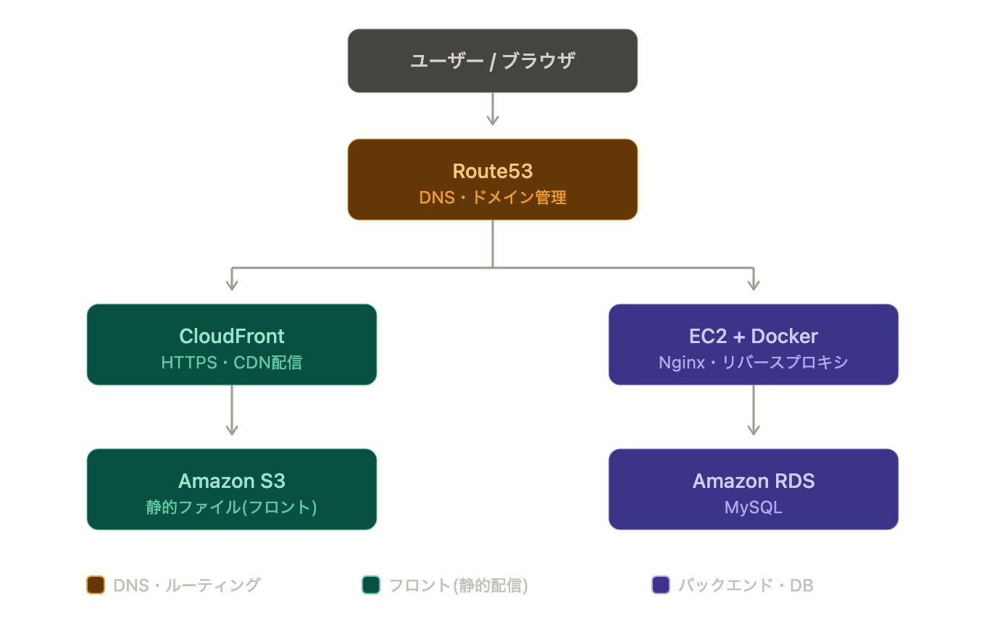
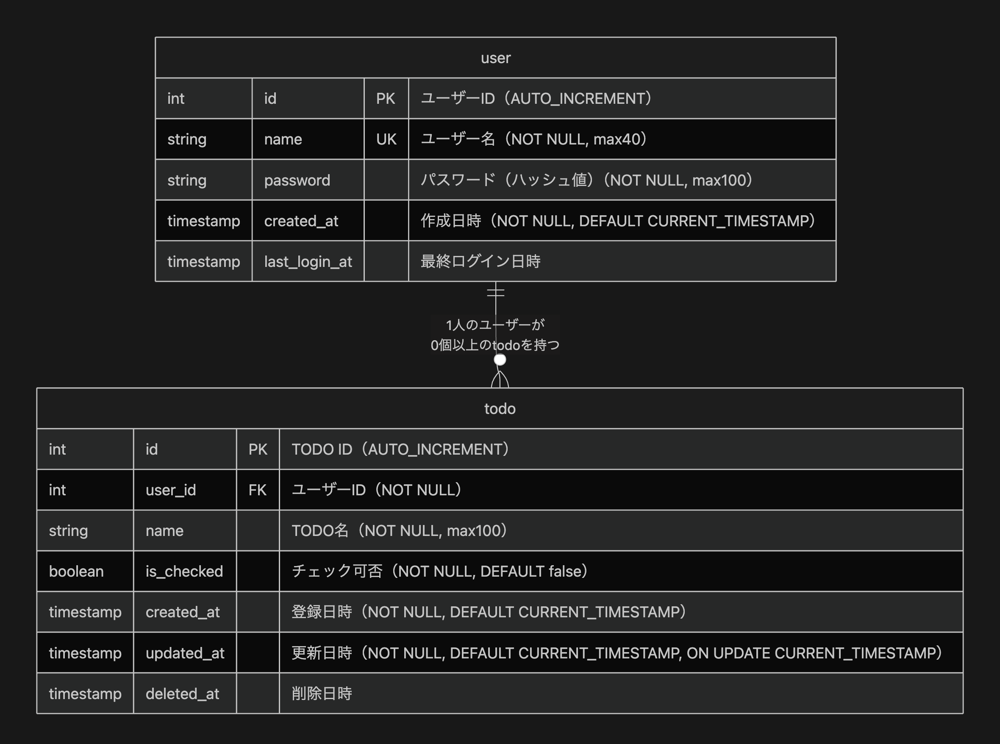

# ハッカソン飛び級課題

## 機能紹介

[Tasks\_機能紹介](https://h-sakana.github.io/hackathon-challenges-todo-app/slides/Tasks_機能紹介.html)

## 使用技術

- フロント
  - React（TypeScript）
- バックエンド
  - Django（Python）
- DB
  - MySQL
- インフラ
  - Docker
  - AWS

## AWS構成



## ER図



## AIを使った箇所

- 方針の壁打ち
  - ChatGPT
  - Claude
- デザインカンプ作成
  - Claude Design
- スライド作成
  - Claude Design

## セットアップ手順

1. ローカルへクローン
   - git clone https://github.com/h-sakana/hackathon-challenges-todo-app.git

2. プロジェクト内へ入る
   - cd hackathon-challenges-todo-app
3. .envファイルを用意
   - cp .env.example .env
   - .envファイルを修正
     ```
     DB_ROOT_PASSWORD=任意
     DB_HOST=db
     DB_NAME=任意
     DB_USER=任意
     DB_PASSWORD=任意
     BACKEND_COMMAND=python manage.py runserver 0.0.0.0:8000
     SECRET_KEY=任意
     DEBUG=True
     ALLOWED_HOSTS=localhost,127.0.0.1
     CORS_ALLOWED_ORIGINS=http://localhost:5173
     ```
4. Dockerコンテナ起動
   - （同プロジェクトで過去に環境構築したことがありDBをクリアしたい人は先に下記を実行）
     - docker compose -f docker-compose.yml -f docker-compose.local.yml down -v
   - docker compose -f docker-compose.yml -f docker-compose.local.yml up -d --build
5. DB作成
   - docker compose -f docker-compose.yml -f docker-compose.local.yml exec backend python manage.py makemigrations
   - docker compose -f docker-compose.yml -f docker-compose.local.yml exec backend python manage.py migrate
6. ブラウザでアクセス
   - http://localhost:5173/
